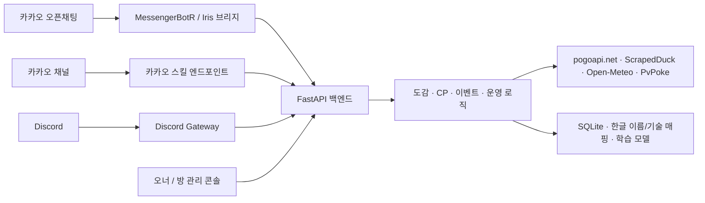

<div align="center">
  
  <h1>KakaoPoGo</h1>
  <p>카카오톡 오픈채팅, 카카오 채널, Discord에서 사용하는 포켓몬GO 정보·방 운영 봇</p>
</div>

처음에는 `/도감 디아루가`처럼 채팅창에서 포켓몬 정보를 바로 확인하려고 만들었습니다.
실제 오픈채팅방에서 운영하면서 출석과 포인트, 레이드 모집, 추첨, 포인트 상점,
이벤트 알림, 방별 관리자 기능을 차례로 추가했습니다. 지금은 카카오톡과 Discord가
같은 서버를 사용하고, 방마다 별도의 설정과 운영 데이터를 관리합니다.

## 구현한 기능

- 카카오 오픈채팅, 카카오 채널, Discord에서 같은 포켓몬GO 조회 기능 제공
- 공식 한국어 이름과 기술명, 폼 별칭, 줄임말, PvP 개체값, 레이드 카운터 지원
- 포인트, 커스텀 명령어, 관리자, 추첨 이력과 운영 정책을 채팅방별로 분리
- 이벤트와 날씨 안내, 출석·랭킹 보상, 상점 수수료·보증금 처리 자동화
- 단타와 음슴체 감지 사례를 관리자가 직접 판정하고 재학습에 반영
- 오너용 운영센터와 방별 관리자 페이지를 모바일 화면에 맞게 제공

## 왜 만들었나

레이드 시간이 되면 방에 "디아루가 100퍼 몇이에요?", "뮤츠 약점 뭐죠?" 같은
질문이 하루에도 몇 번씩 올라옵니다. 그때마다 누군가 검색해서 스크린샷을 찍어
올리는 게 반복되길래, 채팅에서 바로 답해주는 봇을 만들었습니다. 지금도 실제
방에서 돌고 있습니다.

## 응답 예시

실제 채팅 응답은 다음처럼 필요한 정보만 빠르게 읽을 수 있게 구성했습니다.

```text
No.483 디아루가 / Dialga
타입: 강철 / 드래곤
약점: 격투 / 땅

[ 100% CP 계산 ]
리서치 Lv15: 1731 CP
레이드/알 Lv20: 2307 CP
날씨부스트 Lv25: 2884 CP
최대 Lv50: 4565 CP
```

## 뭘 할 수 있나

### 포켓몬GO 정보

| 명령어 | 기능 |
| --- | --- |
| `/도감 디아루가` | 타입, 약점, 100% CP 요약 |
| `/도감 자시안 검왕` | 오리진, 어나더, 검왕, 블랙·화이트큐레무, 메가·원시회귀 같은 폼 조회 |
| `/스킬 피카츄` | 기술과 레이드 추천 조합을 실제 한국어 기술명으로 표시하고 레거시·대기머 구분 |
| `/100 기라티나 오리진` | 리서치·레이드·날씨부스트·최대 레벨의 100% CP 조회 |
| `/약점 뮤츠` | 타입, 약점, 저항 조회 |
| `/카운터 뮤츠` | 레이드에 적합한 카운터 포켓몬 추천 |
| `/cp 피카츄 40 15/15/15` | 원하는 레벨과 개체값의 CP 계산 |
| `/리그 마릴리` | 슈퍼·하이퍼리그 랭크1 개체값 계산 |
| `/슈리`, `/하리`, `/마리` | PvPoke 데이터를 바탕으로 리그별 포켓몬 순위 조회 |
| `/포켓몬고이벤트` | 진행 중·7일 이내 예정 이벤트, 출현 포켓몬, 현재 레이드 조회 |
| `/날씨` | 전국 대표 지역의 오늘 오전·오후 날씨 조회 |
| `/부스트`, `/부스트 서울` | 오늘 날씨에 부스트되는 포켓몬 타입 조회 |

`디아`, `alg`처럼 방에서 실제로 쓰는 줄임말, 도감 번호, 이름 일부도 알아듣습니다.
`/도움말`과 `/명령어`는 현재 방의 커스텀 명령어와 위 기본 기능을 같은 형식으로
보여줍니다. 오너·관리자 전용 명령어는 공개 도움말에 노출하지 않습니다.

### 출석, 채팅 활동과 포인트

| 명령어 | 기능 |
| --- | --- |
| `/오늘의포켓몬` | 오늘의 파트너와 운세를 뽑고 하루 한 번 출석해 5P 적립 |
| `/출석랭킹` | 방별 누적 출석 TOP 10 조회 |
| `/일일랭킹` | 오늘의 채팅 횟수 TOP 10 조회 |
| `/랭킹` | 누적 채팅 횟수 TOP 10 조회 |
| `/추첨` | 오늘 채팅한 사람 중 최근 7일 상품 수령 등록자를 제외하고 활동량 기반 가중치로 추첨 |
| `/포인트` | 채팅·출석·일일랭킹 보상으로 모은 내 포인트 조회 |
| `/포인트순위` | 현재 방의 보유 포인트 TOP 20 조회 |

일반 대화 한 건은 1P로 계산합니다. 봇 명령어와 봇 자신의 메시지는 채팅 집계에서
제외됩니다. 매일 23시 40분 이후에는 일일랭킹 상위 10명에게 순위별 포인트가
한 번만 지급됩니다. 포인트·출석·랭킹·상점은 방별로 분리되므로 같은 사용자라도
다른 방에서는 각각 새로 쌓입니다.

추첨과 실제 상품 수령은 분리됩니다. `/추첨`에 뽑힌 것만으로는 다음 추첨에서
제외되지 않습니다. 상품을 실제로 전달한 뒤 오너 전용 사이트 또는 방 관리 사이트의
`추첨 상품 수령자`에서 닉네임 일부를 검색해 수령자로 등록해야 그날부터 7일 동안
해당 방의 추첨 후보에서 제외됩니다. 잘못 등록했다면 최근 수령 목록에서 취소할 수
있습니다. 오늘 활동자 전원이 최근 수령 등록자라 후보가 한 명도 남지 않으면 그
회차에 한해 제한을 풀고 오늘 활동자 전체에서 다시 추첨합니다.

### 포인트 상점

```text
/상품                              현재 상품과 내 포인트 확인
/상품등록 전설몬 1마리 500        상품 등록
/상품등록 전설몬 1마리 500 나눔왕 지정한 닉네임을 등록자로 상품 등록
/상품삭제 2                       상품 삭제
/구매 1                           1번 상품 구매
/구매내역                         전달 대기 구매 목록
/구매내역삭제 1                   전달을 마친 내역 삭제
/구매내역삭제 전체                구매 내역 전체 정리
/상품명령어                       일반 사용자용 상점 명령어 안내
/상품기능가이드                   관리자용 포인트 상점 전체 사용법
```

구매가 완료된 상품은 목록에서 빠지고 남은 상품 번호가 1번부터 다시 정리됩니다.
상품 등록은 기본적으로 오너 또는 해당 방 관리자만 할 수 있습니다. 오너 전용
사이트와 방 관리 사이트의 `방 운영 설정`에서 일반 사용자 등록을 허용할 수 있으며,
설정은 방마다 따로 적용됩니다. `/상품삭제`와 `/구매내역삭제`는 설정과 관계없이
오너 또는 해당 방 관리자만 사용할 수 있습니다. 구매 내역에는 구매자, 구매일,
상품 등록자가 함께 남으며 전달을 마친 건은 관리자가 번호로 정리합니다. 등록 명령의
포인트 뒤에 닉네임을 생략하면 명령어를 실행한 관리자가 등록자로 표시되고, 닉네임을
적으면 해당 닉네임이 등록자로 표시됩니다.
일반 사용자는 `/상품명령어`로 조회·구매 관련 명령어만 확인할 수 있습니다.
`/상품기능가이드`는 오너와 해당 방 관리자에게만 전체 운영 방법을 보여주며 일반
도움말에는 노출되지 않습니다.

일반 사용자 상품 등록을 허용하면 기본 수수료는 100P, 보증금은 0P입니다. 두 값은
오너 전용 사이트와 방 관리 사이트에서 방별로 바꿀 수 있습니다. 예를 들어 수수료
100P와 보증금 500P를 설정하면 등록 시 600P를 차감하고, 상품이 구매되면 등록자에게
보증금 500P만 돌려줍니다. 수수료는 반환되지 않습니다. 오너와 관리자가 직접 상품을
등록할 때는 수수료와 보증금이 차감되지 않으며, 일반 사용자는 등록자를 다른
닉네임으로 지정할 수 없습니다.

### 레이드 모집

```text
/모집 오리진디아루가 RaidMaster 123456789012
/참가 GoTrainer 오리진디아루가 RaidMaster
/취소 GoTrainer 오리진디아루가 RaidMaster
/현황
/현황 오리진디아루가 RaidMaster
/마감 오리진디아루가 RaidMaster
/가이드
```

누구나 레이드 모집을 열고 참가할 수 있습니다. 명단은 10명 단위 파티로 나뉘며,
숫자가 포함된 닉네임부터 자연스러운 순서로 정렬됩니다. 참가 취소 기록과 현재
방 멤버의 재입장 기록도 별도로 관리합니다.

### 방 운영

- `/칭찬추가 닉네임 내용`은 누구나 사용할 수 있고 `/칭찬 닉네임`으로 기록을 봅니다.
  닉네임에 공백이 있으면 `/칭찬추가 아 아 사유 레이드 도움`처럼 `사유`로
  닉네임과 내용을 구분합니다. 경고도 `/경고추가 아 아 사유 들낙` 형식으로
  동일하게 입력합니다.
- 경고 조회·추가·삭제는 해당 방의 오너·관리자 또는 오너가
  `/경고권한부여`로 경고 업무만 따로 허용한 사람이 사용할 수 있습니다.
- `/들낙`은 해당 방의 오너·관리자만 사용할 수 있으며, 현재 방에 있는 멤버 중
  재입장 기록이 있는 사람을 보여줍니다.
- 관리자 사이트에서 새 관리자를 등록하면 해당 방에 등록 안내가 자동으로
  전송됩니다. 관리자는 `/관리자명령어`로 관리자 전용 사용법을 확인할 수 있으며,
  이 명령어는 별도 역할인 owner에게는 열리지 않습니다.
- 들낙 의심 안내는 기본 5회 이상부터 전송됩니다. 오너 전용 사이트에서 대상 방을
  선택하거나 방별 관리 사이트에서 `안내 메시지 출력 기준 횟수`를 바꿀 수 있습니다.
- `/이벤트알림 켜기`를 설정한 방에는 매일 아침 오늘 시작·종료되는 이벤트와
  다음 날 시작하는 이벤트를 자동으로 보냅니다.
- 코드에 들어 있는 기본 명령어는 모든 방에서 함께 쓰지만, 커스텀 명령어는 등록한
  방에서만 실행되고 다른 방이나 개인 관리방으로 공유되지 않습니다.

### 한국어 문체 관찰

단타 채팅과 반복되는 음슴체를 바로 제재하지 않고 먼저 관찰 자료로 모을 수 있습니다.
단타는 같은 사람이 끊김 없이 연속 전송한 메시지를 다시 합쳤을 때 한 문장이 되는지를
판단합니다. 기본 기준은 12초 안의 2개 메시지이며, 중간에 다른 사용자의 채팅이 끼면
앞선 묶음은 즉시 끝납니다. 따라서 `아 나도` 다음에 `그란돈`을 연달아 보내는 식의
2회 분할도 후보가 되지만 각각 완성된 정상 대화는 모델 점수로 걸러냅니다.

음슴체는 Kiwi 한국어 형태소 분석기와 별도 경량 분류 모델을 함께 사용합니다.
`끝났음`, `가능함`, `아님` 같은 종결형을 찾되 `마음`, `도움`, `처음` 같은 일반 명사는
정상 문장 예시로 학습해 오탐을 줄입니다.

오너 전용 사이트와 방 관리 사이트의 `방 운영 설정`에서 관찰 사용 여부, 단타 메시지
수·관찰 시간, 음슴체 기준을 방별로 조절할 수 있습니다. 단타·음슴체의 채팅방 경고
출력도 각각 끌 수 있습니다. 경고 출력은 사례 수집이 켜진 방에서만 활성화할 수 있고,
경고 출력만 꺼도 감지 사례와 학습용 데이터는 계속 저장됩니다. 음슴체는 기본적으로 한 번만 감지되어도 사례로 저장되며, 경고 출력이
켜져 있으면 채팅방에
`닉네임님 단타 주의해 주세요.` 또는 `닉네임님 음슴체 주의해 주세요.`라고 한 번
안내하고 `문체 관찰 및 학습` 목록에도 표시됩니다. 같은 단타 묶음이 계속 이어져도
안내를 반복하지 않고 관리자 화면의 원문만 갱신합니다. 관리자가 각 사례를
`정확함` 또는 `오탐`으로 판정하면 다음 자동 학습에 쓰이는 라벨 자료가 됩니다.
`/추첨`을 실행한 방은 15초 동안 단타 감지를 잠시 멈춥니다. 이 시간에 보내는
`5`, `4`, `3`, `2`, `1` 카운트다운은 단타 묶음에 포함되지 않으며, 다른 방과
음슴체 감지는 계속 동작합니다.
짧은 원문 미리보기는 최대 240자만 저장하고 30일이 지난 사례는 새 사례가 들어올 때
자동으로 정리됩니다.

서버는 최초 시작 시 합성 예시로 기본 단타·음슴체 모델을 준비하고, 이후 관리자 판정이
50건 더 쌓일 때마다 자동으로 다시 학습합니다. 새 모델은 분리된 검증 자료에서 정밀도와
재현율 기준을 통과하고 현재 모델보다 성능이 크게 떨어지지 않을 때만 활성화됩니다.
오너 전용 사이트의 `자동 학습 모델`에서 현재 버전과 검증 결과를 확인하고, 즉시 재학습
또는 직전 모델 복구를 실행할 수 있습니다. 모델 파일은 `data/models`에 보관됩니다.

Iris로 들어오는 일반 그룹 채팅은 이후 모델 개선에 다시 활용할 수 있도록 방별 학습
원문에도 누적됩니다. 사용자 식별값은 해시로 익명화하고, Iris의 채팅방 ID와 메시지
고유 번호를 조합해 같은 웹훅이 재전송되어도 한 번만 저장합니다. 명령어, 봇이 보낸
메시지, 시스템 메시지, 개인 채팅은 학습 원문에서 제외됩니다. 관리 화면의
`누적 학습 원문`에서 현재 저장 건수를 확인할 수 있습니다.

방장(오너)과 관리자는 방마다 자유 명령어를 가르칠 수 있습니다:

```text
/명령어등록 공지 오늘 레이드 8시
/명령어이어쓰기 공지 둘째 줄
/공지                   -> "오늘 레이드 8시\n둘째 줄"
```

오너는 봇 전체에서 한 명만 존재합니다. 관리자 승인·삭제, 경고 권한, 개인톡에서
공개방을 원격 관리하는 대상방 설정을 지원합니다. `/관리링크`로 방별 웹 관리
페이지를 발급하면 비밀번호를 공유받은 운영자가 브라우저에서 커스텀 명령어를
등록·수정·삭제할 수 있습니다. 운영 명령어 전체 목록은 권한이 있는 사용자가
`/명령어목록`으로 확인합니다.

오너 전용 `/admin` 페이지에서는 상단 배너를 눌러 봇이 들어간 방을 선택한 뒤
그 방의 방장·부방장을 관리자로 지정할 수 있습니다. 닉네임 일부를 검색하면 봇이
해당 방에서 확인한 일치 사용자가 표시되며, 원하는 사람을 선택해 추가합니다.
사용자가 닉네임을 바꾸면 일반 채팅과 명령어 모두에서 새 이름을 확인하는 즉시
방별 사용자·관리자·포인트 등 표시 이름을 최신값으로 갱신합니다. 지정된 권한과
닉네임은 방별로 분리되어 다른 방의 오픈프로필 이름을 덮어쓰지 않습니다.
대상 방을 선택한 뒤 `전용 명령어 관리 사이트`에서 비밀번호와 복구 단어를 처음 한 번
설정하면 그 방만 관리하는 `/r/{token}` 링크를 발급·복사·열기할 수 있습니다. 이미
발급된 방은 같은 고정 링크를 다시 확인하므로 기존에 공유한 주소가 바뀌지 않습니다.
두 관리 사이트는 기능별 접이식 패널로 구성되며, 브라우저가 마지막으로 펼쳐 둔
항목을 기억해 다음 접속에서도 같은 상태로 보여줍니다.

## 시스템 구성



| 영역 | 사용 기술 |
| --- | --- |
| 백엔드 | Python, FastAPI, Pydantic, SQLite |
| 포켓몬 데이터 | pogoapi.net, PvPoke, 한국어 이름·기술 매핑 |
| 외부 정보 | ScrapedDuck/Leek Duck 이벤트, Open-Meteo 날씨 |
| 채팅 연동 | MessengerBotR, Iris, Kakao i Open Builder, Discord.py |
| 운영 도구 | 반응형 HTML/CSS/JavaScript, 방별 인증 링크 |
| 품질 관리 | Pytest, 153개 자동 테스트, 캐시·장애 대응 |

폰 쪽 스크립트는 최대한 얇게 유지합니다. 메시지를 서버로 넘기고 답장을
그대로 뿌리는 것만 하고, 명령어 해석·권한·CP 계산은 전부 서버가 합니다.
폰 스크립트 업데이트가 서버 배포보다 훨씬 귀찮기 때문입니다.

## 직접 돌려보기

Python 3.11+ 기준입니다.

```powershell
python -m venv .venv
.\.venv\Scripts\Activate.ps1
pip install -r requirements.txt
python -m uvicorn app.main:app --reload --host 127.0.0.1 --port 8000
```

로컬에서 명령을 던져보려면:

```powershell
$headers = @{ "X-Bridge-Key" = "YOUR_BRIDGE_KEY" }
Invoke-RestMethod "http://127.0.0.1:8000/command?text=/도감%20피카츄" -Headers $headers
```

카톡에 연결하려면 `kakao/` 의 스크립트 하나를 MessengerBotR류 앱에 붙여넣고
위쪽 두 상수를 채웁니다:

```javascript
const SERVER_URL = "http://YOUR_SERVER_IP:8000/command";
const BRIDGE_KEY = "YOUR_BRIDGE_KEY";   // 서버 BRIDGE_KEY 환경변수와 동일하게
```

카카오톡 채널 챗봇으로 연결할 때는 챗봇 관리자센터에서 스킬을 만들고,
스킬 URL을 서버의 채널 엔드포인트로 등록합니다:

```text
http://YOUR_SERVER_IP:8000/kakao/skill
```

이 엔드포인트는 카카오 챗봇의 `userRequest.utterance` 값을 읽어 기존 봇
명령어와 같은 방식으로 처리한 뒤, 카카오 말풍선 JSON(`simpleText`)으로
응답합니다. `/도움말`, `/명령어`, `/도감 피카츄`, `/스킬 피카츄`,
`/100 디아루가`, `/포켓몬고이벤트` 같은 포켓몬GO 정보 조회 기능을 쓸 수 있습니다.
채널에서는 오픈채팅 운영용 명령어(오너/관리자/커스텀 명령어/출석)는
노출하거나 실행하지 않습니다.

관리자센터에서 HTTPS 주소만 허용되는 환경이라면 도메인과 SSL을 붙인 뒤
같은 경로(`/kakao/skill`)를 등록하면 됩니다.

디스코드 봇으로도 같은 서버를 쓸 수 있습니다. 디스코드는 카카오처럼 HTTP
스킬 서버를 호출하는 방식이 아니라, 봇 프로세스가 Discord Gateway에 계속
접속해 있는 방식입니다.

```bash
DISCORD_BOT_TOKEN=YOUR_DISCORD_BOT_TOKEN \
DISCORD_GUILD_ID=YOUR_TEST_SERVER_ID \
python -m app.discord_bot
```

기본은 디스코드 슬래시 명령어입니다:

```text
/도감 포켓몬:디아루가
/스킬 포켓몬:피카츄
/100 포켓몬:자시안 검왕
/약점 포켓몬:기라티나 오리진
/카운터 포켓몬:뮤츠
/cp 포켓몬:피카츄 레벨:40 공격:15 방어:15 체력:15
/리그 포켓몬:마릴리
/포켓몬고이벤트
/오늘의포켓몬
/출석랭킹
```

오픈채팅 운영 기능도 같은 DB를 사용합니다. `/오너등록`, `/관리자요청`,
`/명령어등록`, `/명령어삭제`, `/명령어목록`을 디스코드 슬래시 명령어로
쓸 수 있습니다. 등록한 커스텀 명령어는 `/명령어실행 명령어:공지`처럼
실행합니다.

커스텀 명령어를 오픈채팅처럼 `/공지` 일반 메시지로도 받고 싶다면
Discord Developer Portal에서 Message Content Intent를 켠 뒤,
`DISCORD_ENABLE_PREFIX=true`로 실행합니다. 이 옵션은 선택 사항입니다.

VPS 배포는 [deploy/IWINV_VPS.md](deploy/IWINV_VPS.md) 참고. 주요 환경변수는 아래와 같습니다:

- `BRIDGE_KEY` — 폰과 서버가 공유하는 인증 키. 설정하면 이 키가 담긴
  `X-Bridge-Key` 헤더 없는 요청은 전부 403으로 거절합니다.
- `OWNER_SETUP_CODE` — `/오너등록` 용 비밀 코드. 비워두거나 기본값이면
  오너 등록 자체가 잠깁니다.
- `DISCORD_BOT_TOKEN` — Discord Developer Portal에서 발급받은 봇 토큰.
- `DISCORD_GUILD_ID` — 테스트 서버 ID. 설정하면 명령어가 해당 서버에 바로
  동기화됩니다. 비워두면 전역 명령어로 등록되어 반영까지 시간이 걸릴 수 있습니다.
- `DISCORD_ENABLE_PREFIX` — `true`로 켜면 일반 메시지 `/공지` 같은 접두사
  명령어도 처리합니다. Discord의 Message Content Intent가 필요합니다.
- `POGO_EVENTS_URL`, `POGO_RAIDS_URL` — 이벤트/레이드 JSON 원본을 바꾸고
  싶을 때만 설정합니다. 기본값은 ScrapedDuck의 Leek Duck 데이터입니다.
- `SITE_BASE_URL` — `/관리링크`에 표시할 공개 서버 주소입니다.
- `EVENT_BRIEF_HOUR` — 이벤트 자동 안내를 시작할 시각입니다. 기본값은 오전 9시입니다.
- `EVENT_BRIEF_CHECK_SECONDS` — 이벤트·랭킹 자동 작업 확인 주기입니다. 기본값은 600초입니다.
- `MODERATION_TRAIN_CHECK_SECONDS` — 새 문체 판정을 확인하고 자동 재학습을 시도하는
  주기입니다. 기본값은 600초입니다.
- `RANK_AWARD_MINUTE` — 23시 이후 일일랭킹 포인트를 지급할 분입니다. 기본값은 40분입니다.
- `POGO_EVENT_CACHE_TTL_SECONDS`, `PVP_RANKING_CACHE_TTL_SECONDS` — 외부 데이터 캐시 시간을
  조정할 때 사용합니다.

## 운영하면서 겪은 것들

**카톡 닉네임은 신원이 아니다.** 처음에는 보낸 사람 닉네임으로 관리자를
알아봤는데, 닉네임은 누구나 순식간에 바꿀 수 있습니다. 지금은 MessengerBotR이
주는 프로필 hash를 신원 키로 쓰고, 닉네임 매칭은 hash가 없던 시절의 옛
레코드를 새 키로 옮겨주는 용도로만 남겼습니다. hash 키가 붙은 관리자는
닉네임을 똑같이 바꿔도 사칭이 안 됩니다.

**서버를 인터넷에 그냥 열어두면 안 된다.** 처음엔 `/command` 가 그대로 열려
있었습니다. 주소만 알면 누구든 카톡 없이 오너 행세를 할 수 있는 구조라,
폰 스크립트와 서버가 비밀 키를 공유하는 `X-Bridge-Key` 헤더 인증을 넣었습니다.

**오너 등록 코드의 기본값이 함정이었다.** 등록 코드 기본값(`change-me`)이
저장소에 그대로 공개돼 있어서, 서버 설정을 깜빡하면 아무나 먼저 오너를
선점할 수 있었습니다. 지금은 기본값이면 등록이 아예 잠깁니다.

**pogoapi.net은 가끔 죽는다.** 데이터 원본이 죽으면 봇이 통째로 500을 뱉었는데,
지금은 만료된 캐시라도 있으면 그걸로 계속 답하고 5분에 한 번만 재접속을
시도합니다. 캐시조차 없으면 "잠시 후 다시 시도해 주세요"라고 답합니다.

**이벤트 일정은 ScrapedDuck/Leek Duck 데이터를 쓴다.** `/포켓몬고이벤트`는
ScrapedDuck의 이벤트·레이드 JSON을 읽고 15분 캐시합니다. 응답 하단에는
데이터 출처를 항상 표시합니다.

**명령어 접두사는 `/` 하나만 받는다.** 오픈채팅에는 봇이 여러 개 있는 경우가
많고 `!` 는 다른 봇들과 자주 겹칩니다. `/` 로 시작하지 않는 메시지는 서버가
조용히 무시해서(silent 응답) 일반 대화에 봇이 끼어들지 않습니다. `/` 로
시작해도 이 봇의 명령어나 방에 등록된 커스텀 명령어가 아니면 역시 침묵합니다.
같은 방의 다른 봇 명령어(`/레이드신청` 같은)에 "알 수 없는 명령어"라고
대꾸하다가는 방이 봇 대답으로 도배되기 때문입니다.

**한글 이름은 결국 수작업이다.** pogoapi 데이터는 전부 영어라서 포켓몬/기술
한글명은 `scripts/generate_korean_*.py` 로 매핑 json을 생성해 씁니다. 다만
"오리진", "검왕", "화이트큐레무" 같은 폼 별칭은 자동화가 안 돼서
`app/name_map.py` 에서 손으로 관리합니다. 신규 포켓몬이 한글로 안 찾아지면
대부분 여기에 별칭을 추가하면 됩니다.

## 한계

- 카카오 공식 API가 아닙니다. 알림 후킹 방식이라 봇 전용 폰이 항상 켜져
  있어야 하고, 카톡 알림에 안 뜨는 메시지는 봇도 못 봅니다.
- 오픈채팅 자동화는 스팸처럼 보이지 않게 보수적으로 운영해야 합니다.
- 실제 서버 IP, 등록 코드, 브리지 키, DB 파일은 커밋하지 않습니다.

## 개발

```powershell
python -m pytest          # 명령어, CP, 권한, 레이드, 상점, 날씨, 이벤트 등 전체 테스트
python scripts/generate_korean_names.py   # 한글 이름 매핑 재생성
python scripts/generate_korean_moves.py   # 한글 기술명 매핑 재생성
```
